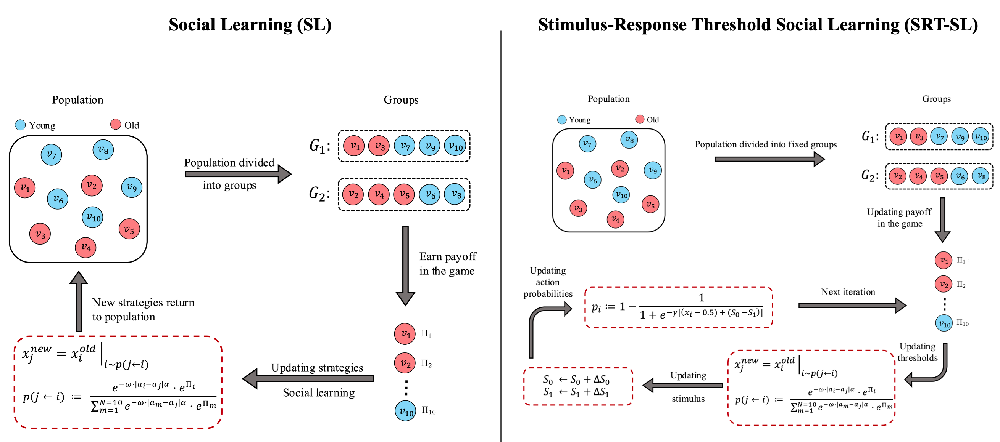
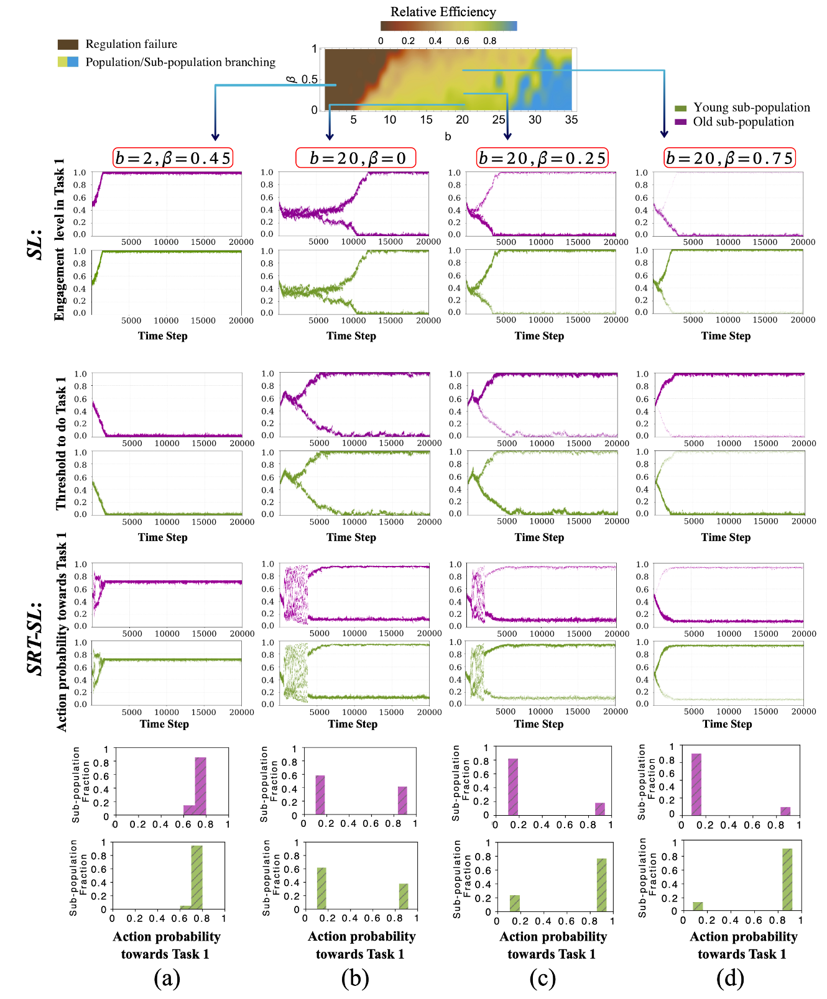

# Age Polyethism 

This repository contains code and analysis related to the paper titled: "Age Polyethism can emerge from social learning: A game-theoretic investigation".

We introduce two models:
- Social Learning (SL): individuals adapt task preferences by imitating similar peers.
- Stimulus-Response Threshold Social Learning (SRT-SL): extends SL by incorporating dynamic task stimuli and response thresholds.

Our results show that:
- Age-polyethism can emerge purely from social learning.
- It breaks down under environmental stress (e.g., resource scarcity).
- It does not always optimize efficiency but reflects trade-offs between coordination and constraints.

These findings offer a mechanistic explanation for how ecological stress can disrupt division of labour and lead to colony collapse.

1. Clone the repository.
2. Open the Jupyter Notebook Age-Polyethism-github.ipynb.
3. Run the notebook cells to reproduce the figures and analyses.

## Dependencies

- Python 3.x
- NumPy
- Pandas
- Matplotlib
- Seaborn
- Jupyter Notebook
